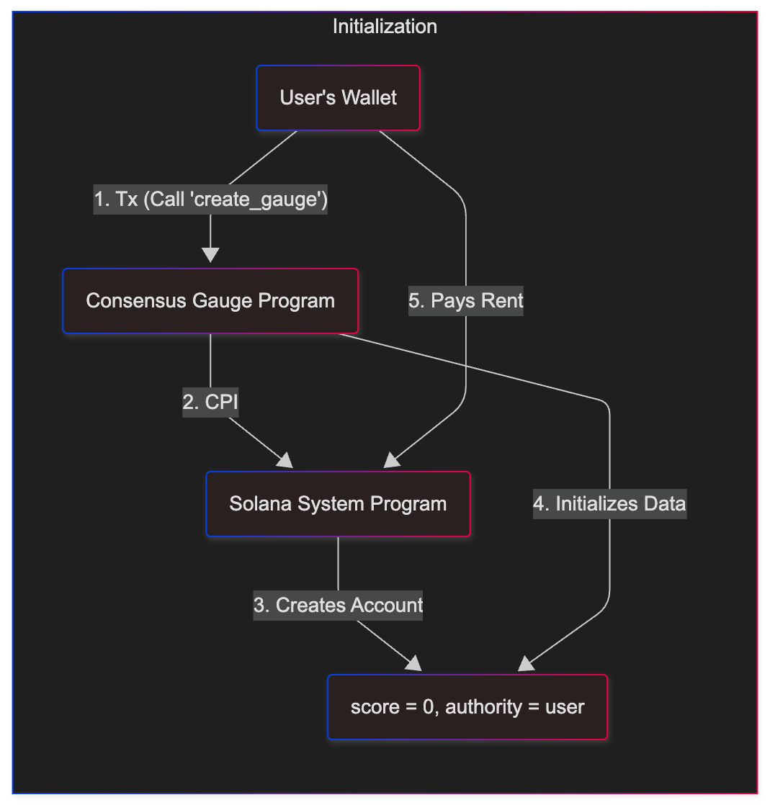
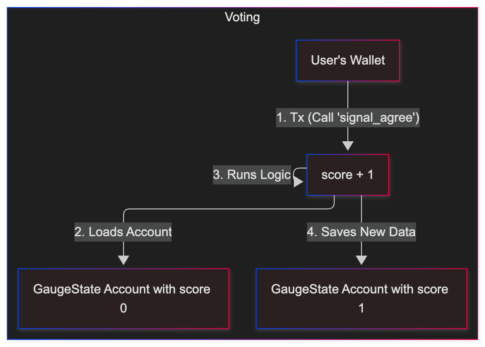

# ⚙️ Decentralized Consensus Gauge

> A minimalist, on-chain Solana program for measuring community sentiment.
>
> Built with [Anchor](https://www.anchor-lang.com/).

---

## 🎯 Core Concept

Community sentiment on platforms like Discord or Telegram is noisy, hard to quantify, and unreliable. This program provides a simple, on-chain "primitive" to get a **verifiable signal** from a community.

It creates a `GaugeState` account on the blockchain that holds a single `score`.

-  **`signal_agree` ➔ `score + 1`**
-  **`signal_disagree` ➔ `score - 1`**

The resulting `score` is a public, tamper-proof, and real-time metric of consensus. A frontend can read this score for free and display it as a simple gauge.

---

## 🏗️ On-Chain Architecture

The program separates logic (the Program) from data (the `GaugeState` Account).

### 1\. `create_gauge` (Initialization)

A user (the "authority") creates a new `GaugeState` account for a specific proposal, initializing its `score` to `0`.



### 2\. `signal_agree` / `signal_disagree` (Voting)

Any user can send a transaction to modify the `score` of an _existing_ `GaugeState` account.



---

## 🚀 Quick Start & Testing

### Prerequisites

-  [Solana Tool Suite](https://docs.solana.com/cli/install-solana-cli-tools)
-  [Anchor Framework](https://www.anchor-lang.com/docs/installation)
-  [Node.js / npm](https://nodejs.org/en/)

### Run Locally

1. **Clone Repo:**

   ```sh
   git clone https://github.com/shivampipalwa/consensus_guage.git
   cd consensus_gauge
   ```

2. **Install Dependencies:**

   ```sh
   npm install
   ```

3. **Build Program:**
   This compiles the Rust code into a Solana BPF binary.

   ```sh
   anchor build
   ```

4. **Run Tests:**
   This is the main command. It spins up a local validator, deploys the program, and runs the `tests/consensus_gauge.ts` script against it.

   ```sh
   anchor test
   ```

**Expected Test Output:**

```
consensus_gauge
    ✔ Is initialized!
    ✔ Signals agree
    ✔ Signals disagree

  3 passing
```

---

## 🔧 Program API

| Instruction       | Accounts Required                                                         | Description                                                                  |
| :---------------- | :------------------------------------------------------------------------ | :--------------------------------------------------------------------------- |
| `create_gauge`    | `gauge_state` (init, payer=`user`)<br>`user` (signer)<br>`system_program` | Initializes a new gauge, setting `score` to 0 and `authority` to the `user`. |
| `signal_agree`    | `gauge_state` (mut)<br>`user` (signer)                                    | Atomically increments the `score` of the `gauge_state` by 1.                 |
| `signal_disagree` | `gauge_state` (mut)<br>`user` (signer)                                    | Atomically decrements the `score` of the `gauge_state` by 1.                 |

---

## 🗺️ Future Improvements

This program is a simple primitive. It could be extended with more advanced features, such as:

-  **Vote Spamming Protection:** Currently, any wallet can call `signalAgree` or `signalDisagree` an unlimited number of times. A future version could implement a "voting token" or check for ownership of a specific NFT to allow only one vote per "member."
-  **Weighted Voting:** The instruction could take an `amount` parameter, allowing users to stake tokens for a heavier vote.
-  **Time-Locked Gauges:** Add `open_timestamp` and `close_timestamp` fields to the `GaugeState` to enforce a specific voting window.
-  **Multiple Polls:** A "master" program that can create and manage many different gauges, each tied to a unique ID.

---
